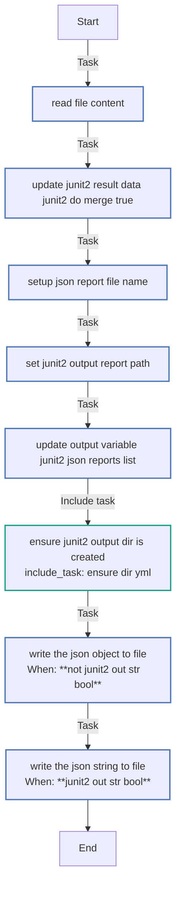
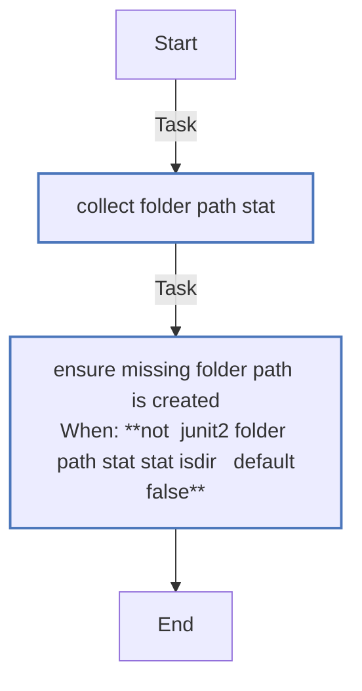
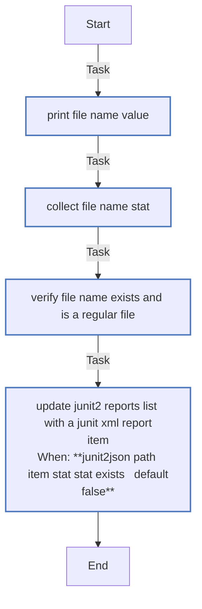
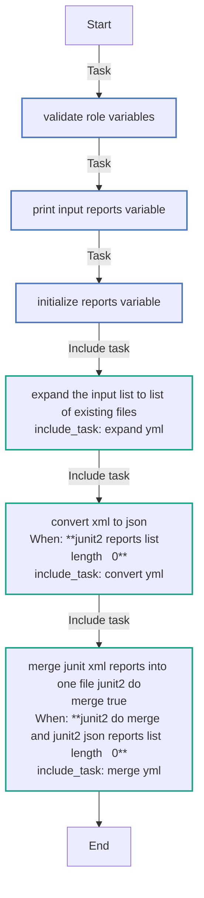

<!-- DOCSIBLE START -->

# 📃 Role overview

## junit2json

Description: Converts XML junit reports passed or in passed directory into single or fragmented JSON report file(s)

<details>
<summary><b>🧩 Argument Specifications in meta/argument_specs</b></summary>

### Key: main

**Description**: The resulting JSON file(s) are of the same structure for all the teams' and CI systems
and later used to be sent to the data collection system. This is the main entrypoint
for the role `junit2json`. Converts XMLs into JSON, if variable `junit2_do_merge` is `true`,
multiple XMLs are merged into one XML file.
Outputs:

- merged filename location is stored in the variable `junit2_output_merged_report`.
- variable `junit2_json_reports_list` contains list of all converted JSON file names
It is user's responsibility to consumer the right variable(s) in the next role(s).

- **junit2_input_reports_list**
  - **Required**: True
  - **Type**: list
  - **Default**: none
  - **Description**: List of JUnit XML report files to convert to JSON

- **junit2_do_merge**
  - **Required**: False
  - **Type**: bool
  - **Default**: True
  - **Description**: Should we merge data of converted reports into 1 file or not. When `false`, each report `XML` file
is converted to a corresponding json file appended `.json` extension.
Otherwise, resulting merged report is named as the directory, with `.report.json` extension.
In both cases, the result is stored under `junit2_output_dir`.

- **junit2_output_dir**
  - **Required**: True
  - **Type**: str
  - **Default**: none
  - **Description**: Output directory for resulting report JSON file path(s)

- **junit2_input_merged_report**
  - **Required**: False
  - **Type**: str
  - **Default**: merged.junit.xml
  - **Description**: Relative file name for the Merged XML report (relevant only when `junit2_do_merge` is `true`),
it is generated under `junit2_output_dir`

- **junit2_output_merged_report**
  - **Required**: False
  - **Type**: str
  - **Default**: merged.junit.json
  - **Description**: Relative file name for the JSON report (relevant only when `junit2_do_merge` is `true`),
it is generated under `junit2_output_dir`

- **junit2_json_reports_list**
  - **Required**: False
  - **Type**: list
  - **Default**: []
  - **Description**: This is the output variable updated by the role for the converted JSON reports file names.
If it is defined outside of the role, the role updates it.

- **junit2_out_str**
  - **Required**: False
  - **Type**: bool
  - **Default**: True
  - **Description**: If true, the call to filter should pass object=true, otherwise object=false is passed.

</details>

### Defaults

#### These are static variables with lower priority

#### File: `defaults/main.yml`

| Var          | Type         | Value       |Required    | Title       |
|--------------|--------------|-------------|-------------|-------------|
| [junit2_custom_dummy_variables](defaults/main.yml#L7)   | dict   | `{}` |    n/a  |  n/a |
| [junit2_dummy_debug](defaults/main.yml#L10)   | bool   | `False` |    n/a  |  n/a |
| [junit2_input_merged_report](defaults/main.yml#L13)   | str   | `merged.junit.xml` |    n/a  |  n/a |
| [junit2_output_merged_report](defaults/main.yml#L14)   | str   | `merged.junit.json` |    n/a  |  n/a |
| [junit2_do_merge](defaults/main.yml#L15)   | bool   | `True` |    n/a  |  n/a |
| [junit2_out_str](defaults/main.yml#L16)   | bool   | `True` |    n/a  |  n/a |

### Vars

#### These are variables with higher priority

#### File: `vars/dummy_variables.yml`

| Var          | Type         | Value       |Required    | Title       |
|--------------|--------------|-------------|-------------|-------------|
| [junit2_dummy_variables](vars/dummy_variables.yml#L9)   | dict   | `{'expectation_failed': 'PLACEHOLDER_EXPECTATION_FAILED', 'job_info': {'job': {'id': 'PLACEHOLDER_JOB_ID', 'name': 'PLACEHOLDER_JOB_NAME', 'url': 'PLACEHOLDER_JOB_URL'}, 'build': {'number': 'PLACEHOLDER_BUILD_NUMBER', 'url': 'PLACEHOLDER_BUILD_URL'}}, 'ci_job_id': 'PLACEHOLDER_CI_JOB_ID', 'ci_build_id': 'PLACEHOLDER_CI_BUILD_ID', 'ci_pipeline_id': 'PLACEHOLDER_CI_PIPELINE_ID', 'test_environment': 'PLACEHOLDER_TEST_ENV', 'cluster_name': 'PLACEHOLDER_CLUSTER_NAME', 'namespace': 'PLACEHOLDER_NAMESPACE', 'error_message': 'PLACEHOLDER_ERROR_MESSAGE', 'failure_reason': 'PLACEHOLDER_FAILURE_REASON', 'exception_details': 'PLACEHOLDER_EXCEPTION_DETAILS', 'timestamp': 'PLACEHOLDER_TIMESTAMP', 'test_start_time': 'PLACEHOLDER_TEST_START_TIME', 'test_end_time': 'PLACEHOLDER_TEST_END_TIME'}` |    n/a  |  n/a |

### Tasks

#### File: ``tasks/convert.yml``

| Name | Module | Has Conditions |
| ---- | ------ | --------- |
| Read file content | ansible.builtin.set_fact | False |
| Update junit2_result_data junit2_do_merge=true | ansible.builtin.set_fact | False |
| Setup JSON report file name | ansible.builtin.set_fact | False |
| Set junit2_output_report_path | ansible.builtin.set_fact | False |
| Update output variable junit2_json_reports_list | ansible.builtin.set_fact | False |
| Ensure junit2_output_dir is created | ansible.builtin.include_tasks | False |
| Write the json object to file | ansible.builtin.copy | True |
| Write the json string to file | ansible.builtin.copy | True |

#### File: ``tasks/merge.yml``

| Name | Module | Has Conditions |
| ---- | ------ | --------- |
| Load dummy variables configuration | ansible.builtin.include_vars | False |
| Merge custom dummy variables with defaults | ansible.builtin.set_fact | True |
| Debug dummy variables being set | ansible.builtin.debug | True |
| Set dummy variables for template strings in test data | ansible.builtin.set_fact | True |
| Ensure junit2_output_dir is created | ansible.builtin.include_tasks | False |
| Merge multiple JSON report files into single consolidated report | ansible.builtin.set_fact | False |
| Debug merged file path | ansible.builtin.debug | False |

#### File: `tasks/ensure-dir.yml`

| Name | Module | Has Conditions |
| ---- | ------ | --------- |
| Collect folder_path stat | ansible.builtin.stat | False |
| Ensure missing folder_path is created | ansible.builtin.file | True |

#### File: `tasks/expand.yml`

| Name | Module | Has Conditions |
| ---- | ------ | --------- |
| Print file_name value | ansible.builtin.debug | False |
| Collect file_name stat | ansible.builtin.stat | False |
| Verify file_name exists and is a regular file | ansible.builtin.assert | False |
| Update junit2_reports_list with a JUnit XML report item | ansible.builtin.set_fact | True |

#### File: `tasks/main.yml`

| Name | Module | Has Conditions |
| ---- | ------ | --------- |
| Validate role variables | ansible.builtin.assert | False |
| Print input reports variable | ansible.builtin.debug | False |
| Initialize reports variable | ansible.builtin.set_fact | False |
| Expand the input list to list of existing files | ansible.builtin.include_tasks | False |
| Convert XML to JSON | ansible.builtin.include_tasks | True |
| Merge JUnit XML reports into one file junit2_do_merge=true | ansible.builtin.include_tasks | True |

## Task Flow Graphs

### Graph for convert.yml



### Graph for merge.yml

```mermaid
flowchart TD
Start
classDef block stroke:#3498db,stroke-width:2px;
classDef task stroke:#4b76bb,stroke-width:2px;
classDef includeTasks stroke:#16a085,stroke-width:2px;
classDef importTasks stroke:#34495e,stroke-width:2px;
classDef includeRole stroke:#2980b9,stroke-width:2px;
classDef importRole stroke:#699ba7,stroke-width:2px;
classDef includeVars stroke:#8e44ad,stroke-width:2px;
classDef rescue stroke:#665352,stroke-width:2px;

  Start-->|Include vars| dummy_variables_yml0[load dummy variables configuration<br>include_vars: dummy variables yml]:::includeVars
  dummy_variables_yml0-->|Task| Merge_custom_dummy_variables_with_defaults1[merge custom dummy variables with defaults<br>When: **junit2 custom dummy variables   length   0 and<br>junit2 dummy variables   default       length   0**]:::task
  Merge_custom_dummy_variables_with_defaults1-->|Task| Debug_dummy_variables_being_set2[debug dummy variables being set<br>When: **junit2 dummy debug   bool and junit2 dummy<br>variables   default       length   0**]:::task
  Debug_dummy_variables_being_set2-->|Task| Set_dummy_variables_for_template_strings_in_test_data3[set dummy variables for template strings in test<br>data<br>When: **vars item key  is not defined and junit2 dummy<br>variables   default       length   0**]:::task
  Set_dummy_variables_for_template_strings_in_test_data3-->|Include task| ensure_dir_yml4[ensure junit2 output dir is created<br>include_task: ensure dir yml]:::includeTasks
  ensure_dir_yml4-->|Task| Merge_multiple_JSON_report_files_into_single_consolidated_report5[merge multiple json report files into single<br>consolidated report]:::task
  Merge_multiple_JSON_report_files_into_single_consolidated_report5-->|Task| Debug_merged_file_path6[debug merged file path]:::task
  Debug_merged_file_path6-->End
```



### Graph for ensure-dir.yml



### Graph for expand.yml



### Graph for main.yml



## Playbook

```yml
---

- name: Test junit2json role - simple input
  hosts: localhost
  connection: local
  vars:
    junit2_output_merged_report: 'merged.junit.json'
  tasks:
    - name: Run tests for both values of junit2_out_str
      block:
        - name: Test role junit2json without merge junit2_out_str=true
          ansible.builtin.include_role:
            name: junit2json
          vars:
            junit2_input_reports_list:
              - "{{ role_path }}/tests/unit/data/test_junit2obj_simple_input.xml"
            junit2_output_dir: "{{ role_path }}"
            junit2_do_merge: false
            junit2_out_str: true

        - name: Load actual result into variable actual junit2_out_str=true
          ansible.builtin.set_fact:
            actual: "{{ lookup('file', role_path + '/tests/unit/data/test_junit2obj_simple_input.json') | from_json }}"

        - name: Load expected result into variable expected junit2_out_str=true
          ansible.builtin.set_fact:
            expected: "{{ lookup('file', role_path + '/tests/unit/data/test_junit2obj_simple_result.json') }}"

        - name: Ensure test passes junit2_out_str=true
          ansible.builtin.assert:
            that:
              - actual == expected

        - name: Reset global variable junit2_out_str=true
          ansible.builtin.set_fact:
            junit2_json_reports_list: []

        - name: Test role junit2json with merge junit2_out_str=true
          ansible.builtin.include_role:
            name: junit2json
          vars:
            junit2_input_reports_list:
              - "{{ role_path }}/tests/unit/data/test_junit2obj_simple_input.xml"
              - "{{ role_path }}/tests/unit/data/test_junit2obj_failure_input.xml"
            junit2_output_dir: "{{ role_path }}/tests"
            junit2_do_merge: true
            junit2_out_str: true

        - name: Load actual result into variable actual junit2_out_str=true
          ansible.builtin.set_fact:
            actual: "{{ lookup('file', junit2_result_merged_file) | from_json }}"

        - name: Load expected result into variable expected junit2_out_str=true
          ansible.builtin.set_fact:
            expected: "{{ lookup('file', role_path + '/tests/unit/data/' + junit2_output_merged_report) }}"

        - name: Ensure test passes junit2_out_str=true
          ansible.builtin.assert:
            that:
              - actual == expected

        - name: Test role junit2json without merge junit2_out_str=false
          ansible.builtin.include_role:
            name: junit2json
          vars:
            junit2_input_reports_list:
              - "{{ role_path }}/tests/unit/data/test_junit2obj_simple_input.xml"
            junit2_output_dir: "{{ role_path }}/tests"
            junit2_do_merge: false
            junit2_out_str: false

        - name: Load actual result into variable actual junit2_out_str=false
          ansible.builtin.set_fact:
            actual: "{{ lookup('file', role_path + '/tests/unit/data/test_junit2obj_simple_input.json') | from_json }}"

        - name: Load expected result into variable expected junit2_out_str=false
          ansible.builtin.set_fact:
            expected: "{{ lookup('file', role_path + '/tests/unit/data/test_junit2obj_simple_result.json') }}"

        - name: Ensure test passes junit2_out_str=false
          ansible.builtin.assert:
            that:
              - actual == expected

        - name: Reset global variable junit2_out_str=false
          ansible.builtin.set_fact:
            junit2_json_reports_list: []

        - name: Test role junit2json with merge junit2_out_str=false
          ansible.builtin.include_role:
            name: junit2json
          vars:
            junit2_input_reports_list:
              - "{{ role_path }}/tests/unit/data/test_junit2obj_simple_input.xml"
              - "{{ role_path }}/tests/unit/data/test_junit2obj_failure_input.xml"
            junit2_output_dir: "{{ role_path }}/tests"
            junit2_do_merge: true
            junit2_out_str: false

        - name: Load actual result into variable actual junit2_out_str=false
          ansible.builtin.set_fact:
            actual: "{{ lookup('file', junit2_result_merged_file) | from_json }}"

        - name: Load expected result into variable expected junit2_out_str=false
          ansible.builtin.set_fact:
            expected: "{{ lookup('file', role_path + '/tests/unit/data/' + (junit2_result_merged_file | basename)) }}"

        - name: Ensure test passes junit2_out_str=false
          ansible.builtin.assert:
            that:
              - actual == expected

```

## Playbook graph

```mermaid
flowchart TD
  localhost-->|Block Start| Run_tests_for_both_values_of_junit2_out_str0_block_start_0[[run tests for both values of junit2 out str]]:::block
  Run_tests_for_both_values_of_junit2_out_str0_block_start_0-->|Include role| junit2json0(test role junit2json without merge junit2 out str<br>true<br>include_role: junit2json):::includeRole
  junit2json0-->|Task| Load_actual_result_into_variable_actual_junit2_out_str_true1[load actual result into variable actual junit2 out<br>str true]:::task
  Load_actual_result_into_variable_actual_junit2_out_str_true1-->|Task| Load_expected_result_into_variable_expected_junit2_out_str_true2[load expected result into variable expected junit2<br>out str true]:::task
  Load_expected_result_into_variable_expected_junit2_out_str_true2-->|Task| Ensure_test_passes_junit2_out_str_true3[ensure test passes junit2 out str true]:::task
  Ensure_test_passes_junit2_out_str_true3-->|Task| Reset_global_variable_junit2_out_str_true4[reset global variable junit2 out str true]:::task
  Reset_global_variable_junit2_out_str_true4-->|Include role| junit2json5(test role junit2json with merge junit2 out str<br>true<br>include_role: junit2json):::includeRole
  junit2json5-->|Task| Load_actual_result_into_variable_actual_junit2_out_str_true6[load actual result into variable actual junit2 out<br>str true]:::task
  Load_actual_result_into_variable_actual_junit2_out_str_true6-->|Task| Load_expected_result_into_variable_expected_junit2_out_str_true7[load expected result into variable expected junit2<br>out str true]:::task
  Load_expected_result_into_variable_expected_junit2_out_str_true7-->|Task| Ensure_test_passes_junit2_out_str_true8[ensure test passes junit2 out str true]:::task
  Ensure_test_passes_junit2_out_str_true8-->|Include role| junit2json9(test role junit2json without merge junit2 out str<br>false<br>include_role: junit2json):::includeRole
  junit2json9-->|Task| Load_actual_result_into_variable_actual_junit2_out_str_false10[load actual result into variable actual junit2 out<br>str false]:::task
  Load_actual_result_into_variable_actual_junit2_out_str_false10-->|Task| Load_expected_result_into_variable_expected_junit2_out_str_false11[load expected result into variable expected junit2<br>out str false]:::task
  Load_expected_result_into_variable_expected_junit2_out_str_false11-->|Task| Ensure_test_passes_junit2_out_str_false12[ensure test passes junit2 out str false]:::task
  Ensure_test_passes_junit2_out_str_false12-->|Task| Reset_global_variable_junit2_out_str_false13[reset global variable junit2 out str false]:::task
  Reset_global_variable_junit2_out_str_false13-->|Include role| junit2json14(test role junit2json with merge junit2 out str<br>false<br>include_role: junit2json):::includeRole
  junit2json14-->|Task| Load_actual_result_into_variable_actual_junit2_out_str_false15[load actual result into variable actual junit2 out<br>str false]:::task
  Load_actual_result_into_variable_actual_junit2_out_str_false15-->|Task| Load_expected_result_into_variable_expected_junit2_out_str_false16[load expected result into variable expected junit2<br>out str false]:::task
  Load_expected_result_into_variable_expected_junit2_out_str_false16-->|Task| Ensure_test_passes_junit2_out_str_false17[ensure test passes junit2 out str false]:::task
  Ensure_test_passes_junit2_out_str_false17-.->|End of Block| Run_tests_for_both_values_of_junit2_out_str0_block_start_0
```



## Author Information

Max Kovgan

### License

Apache-2.0

### Minimum Ansible Version

2.9

### Platforms

No platforms specified.
<!-- DOCSIBLE END -->
